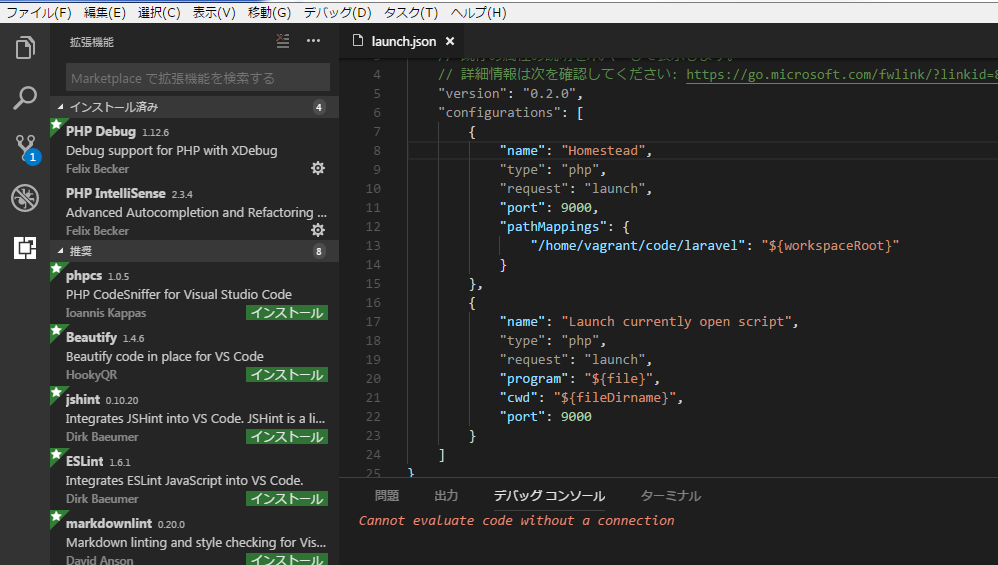
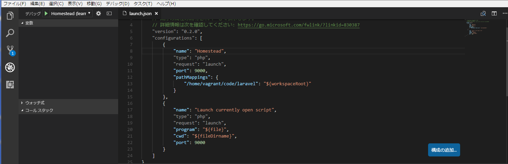

# 概要
VSCode + vagrant(Homestead) + xdebugでphpのデバッグ環境を作る

# 前提
・vscodeがインストールされていること  
・vagrantがインストールされていること  
・homesteadを利用してlaravelの環境構築が完了していること  

# 手順
#### vagrant立ち上げ
```
vagrant up 
vagrant ssh
```
#### xdebug.ini修正
```
sudo vi /etc/php/7.2/fpm/conf.d/20-xdebug.ini
```
下記内容に修正
```
zend_extension=xdebug.so
xdebug.remote_enable = 1
#xdebug.remote_connect_back = 1
xdebug.remote_port = 9000
#xdebug.max_nesting_level = 512
xdebug.remote_host=10.0.2.2
xdebug.remote_autostart = 1
```
#### 念のためリロード
```
vagrant reload
```

### VSCode設定

#### php debugインストール
拡張機能から「php debug」をインストール


<br>

#### launch.json変更
※pathMappingsについては環境に合わせて適宜変更  
```json
    "configurations": [
        {
            "name": "Homestead",
            "type": "php",
            "request": "launch",
            "port": 9000,
            "pathMappings": {
                "/home/vagrant/code/laravel": "${workspaceRoot}"
            }
        },
        {
            "name": "Launch currently open script",
            "type": "php",
            "request": "launch",
            "program": "${file}",
            "cwd": "${fileDirname}",
            "port": 9000
        }
    ]
```

